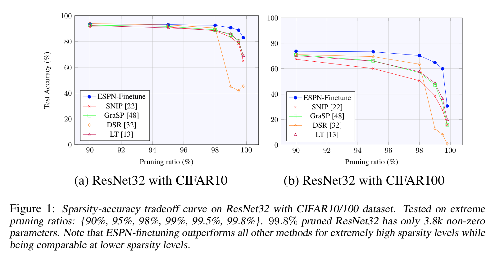

## ESPN: Extremely Sparse Pruned Networks

This is the code to reproduce the results from the paper.

### Setup

To setup the environment, use the requirements.txt file. 

Basic requirements:

1. Pytorch == 1.5.0
2. Torchvision == 0.6.0
3. Numpy == 1.18.4
4. Pytorch-Ignite == 0.3.0 
5. tqdm == 4.46.0

We provide the unpruned pretrained models from this [link](https://drive.google.com/drive/folders/18wHTHOgAxMZhMKGqKzXmPGHiTbZIN7GN?usp=sharing). Download a folder named `models` and save it in the same directory to this directory.

### Codes

We include the codes for experiments conducted in the papers as following: 

`prune_espn_finetune.py`: ESPN-Finetune prunes (1) LeNet300, LeNet5-Caffe for MNIST/Fashion-MNIST, (2) VGG19, ResNet32 for CIFAR-10/100, (3) VGG19, ResNet32 for Tiny-ImageNet. 

`prune_espn_rewind.py`: ESPN-Rewind prunes (1) LeNet300, LeNet5-Caffe for MNIST/Fashion-MNIST, (2) VGG19, ResNet32 for CIFAR-10/100, (3) VGG19, ResNet32 for Tiny-ImageNet. 

`prune_espn_imagenet_finetune.py`: ESPN-Finetune pruning ResNet50 for ImageNet dataset. We use the pretrained model in Torchvision. Returns the mask and the model before finetuning.

`train_imagenet_finetune.py`: Finetuning the ResNet50 on ImageNet dataset from the `prune_espn_imagenet_finetune.py` outputs. The code based on official pytorch implementation on ImageNet training from [main.py](https://github.com/pytorch/examples/blob/master/imagenet/main.py).

`prune_espn_imagenet_rewind.py`: ESPN-Rewind pruning ResNet50 for ImageNet dataset. We use the untrained model in Torchvision. Returns the mask and the model with warmup training.

`train_imagenet_rewind.py`: Finetuning the ResNet50 on ImageNet dataset from the `prune_espn_imagenet_rewind.py` outputs. The code based on official pytorch implementation on ImageNet training from [main.py](https://github.com/pytorch/examples/blob/master/imagenet/main.py).

### Experiments

We list the script to run for the experiments we collected in our paper. ESPN-Finetune requires the `models` file to run it (Download from [HERE](https://drive.google.com/drive/folders/18wHTHOgAxMZhMKGqKzXmPGHiTbZIN7GN?usp=sharing)). Tiny-ImageNet and ImageNet needs to be downloaded separately and modify the directory in `datasets.py`.

### MNIST/Fashion-MNIST

#### MNIST/LeNet300

ESPN-Finetune p=95%: `python prune_espn_finetune.py "mnist" "lenet300" "./output/mnist/lenet300/" "./models/mnist/lenet300/checkpoint.pth.tar" --logname "espn_finetune_mnist_lenet300_95percent.txt" --alpha 8e-5 --lr 0.05 --keep_ratio 0.05`

ESPN-Finetune p=98%: `python prune_espn_finetune.py "mnist" "lenet300" "./output/mnist/lenet300/" "./models/mnist/lenet300/checkpoint.pth.tar" --logname "espn_finetune_mnist_lenet300_98percent.txt" --alpha 8e-5 --lr 0.05 --keep_ratio 0.02`

ESPN-Finetune p=99%: `python prune_espn_finetune.py "mnist" "lenet300" "./output/mnist/lenet300/" "./models/mnist/lenet300/checkpoint.pth.tar" --logname "espn_finetune_mnist_lenet300_99percent.txt" --alpha 0.00015 --lr 0.05 --keep_ratio 0.01`

ESPN-Finetune p=99.6%: `python prune_espn_finetune.py "mnist" "lenet300" "./output/mnist/lenet300/" "./models/mnist/lenet300/checkpoint.pth.tar" --logname "espn_finetune_mnist_lenet300_996percent.txt" --alpha 0.00025 --lr 0.05 --keep_ratio 0.004`

ESPN-Rewind p=95%: `python prune_espn_rewind.py "mnist" "lenet300" "./output/mnist/lenet300/" --epochs_warmup 1 --logname "espn_rewind_mnist_lenet300_95percent.txt" --lr 0.01 --alpha 8e-5 --keep_ratio 0.05`

ESPN-Rewind p=98%: `python prune_espn_rewind.py "mnist" "lenet300" "./output/mnist/lenet300/" --epochs_warmup 1 --logname "espn_rewind_mnist_lenet300_98percent.txt" --lr 0.01 --alpha 8e-5 --keep_ratio 0.02`

ESPN-Rewind p=99%: `python prune_espn_rewind.py "mnist" "lenet300" "./output/mnist/lenet300/" --epochs_warmup 1 --logname "espn_rewind_mnist_lenet300_99percent.txt" --lr 0.01 --alpha 0.00015 --keep_ratio 0.01`

ESPN-Rewind p=99.6%: `python prune_espn_rewind.py "mnist" "lenet300" "./output/mnist/lenet300/" --epochs_warmup 1 --logname "espn_rewind_mnist_lenet300_996percent.txt" --lr 0.01 --alpha 0.0006 --keep_ratio 0.004`

#### MNIST/LeNet-5_Caffe

ESPN-Finetune p=95%: `python prune_espn_finetune.py "mnist" "lenet_5_caffe" "./output/mnist/lenet_5_caffe/" "./models/mnist/lenet_5_caffe/checkpoint.pth.tar" --logname "espn_finetune_mnist_lenet_5_caffe_95percent.txt" --alpha 6e-5 --lr 0.05 --keep_ratio 0.05`

ESPN-Finetune p=98%: `python prune_espn_finetune.py "mnist" "lenet_5_caffe" "./output/mnist/lenet_5_caffe/" "./models/mnist/lenet_5_caffe/checkpoint.pth.tar" --logname "espn_finetune_mnist_lenet_5_caffe_98percent.txt" --alpha 6e-5 --lr 0.05 --keep_ratio 0.02`

ESPN-Finetune p=99%: `python prune_espn_finetune.py "mnist" "lenet_5_caffe" "./output/mnist/lenet_5_caffe/" "./models/mnist/lenet_5_caffe/checkpoint.pth.tar" --logname "espn_finetune_mnist_lenet_5_caffe_99percent.txt" --alpha 0.0001 --lr 0.05 --keep_ratio 0.01`

ESPN-Finetune p=99.6%: `python prune_espn_finetune.py "mnist" "lenet_5_caffe" "./output/mnist/lenet_5_caffe/" "./models/mnist/lenet_5_caffe/checkpoint.pth.tar" --logname "espn_finetune_mnist_lenet_5_caffe_996percent.txt" --alpha 0.0003 --lr 0.05 --keep_ratio 0.004`

ESPN_Rewind p=95%: `python prune_espn_rewind.py "mnist" "lenet_5_caffe" "./output/mnist/lenet_5_caffe/" --epochs_warmup 1 --logname "espn_rewind_mnist_lenet_5_caffe_95percent.txt" --lr 0.1 --alpha 8e-5 --keep_ratio 0.05`

ESPN_Rewind p=98%: `python prune_espn_rewind.py "mnist" "lenet_5_caffe" "./output/mnist/lenet_5_caffe/" --epochs_warmup 1 --logname "espn_rewind_mnist_lenet_5_caffe_98percent.txt" --lr 0.1 --alpha 0.0001 --keep_ratio 0.02`

ESPN_Rewind p=99%: `python prune_espn_rewind.py "mnist" "lenet_5_caffe" "./output/mnist/lenet_5_caffe/" --epochs_warmup 1 --logname "espn_rewind_mnist_lenet_5_caffe_99percent.txt" --lr 0.1 --alpha 0.00025 --keep_ratio 0.01`

ESPN_Rewind p=99.6%: `python prune_espn_rewind.py "mnist" "lenet_5_caffe" "./output/mnist/lenet_5_caffe/" --epochs_warmup 1 --logname "espn_rewind_mnist_lenet_5_caffe_996percent.txt" --lr 0.1 --alpha 0.0005 --keep_ratio 0.004`

#### Fashion-MNIST/LeNet300

ESPN_Finetune p=95%: `python prune_espn_finetune.py "fashion_mnist" "lenet300" "./output/fashion_mnist/lenet300" "./models/fashion_mnist/lenet300/checkpoint.pth.tar" --logname "espn_finetune_fmnist_lenet300_95percent.txt" --alpha 8e-5 --lr 0.05 --keep_ratio 0.05`

ESPN_Finetune p=98%: `python prune_espn_finetune.py "fashion_mnist" "lenet300" "./output/fashion_mnist/lenet300" "./models/fashion_mnist/lenet300/checkpoint.pth.tar" --logname "espn_finetune_fmnist_lenet300_98percent.txt" --alpha 8e-5 --lr 0.05 --keep_ratio 0.02`

ESPN_Finetune p=99%: `python prune_espn_finetune.py "fashion_mnist" "lenet300" "./output/fashion_mnist/lenet300" "./models/fashion_mnist/lenet300/checkpoint.pth.tar" --logname "espn_finetune_fmnist_lenet300_99percent.txt" --alpha 0.00015 --lr 0.05 --keep_ratio 0.01`

ESPN_Finetune p=99.6%: `python prune_espn_finetune.py "fashion_mnist" "lenet300" "./output/fashion_mnist/lenet300" "./models/fashion_mnist/lenet300/checkpoint.pth.tar" --logname "espn_finetune_fmnist_lenet300_996percent.txt" --alpha 0.0006 --lr 0.05 --keep_ratio 0.004`

ESPN_Rewind p=95%: `python prune_espn_rewind.py "fashion_mnist" "lenet300" "./output/fashion_mnist/lenet300/" --epochs_warmup 1 --logname "espn_rewind_fmnist_lenet300_95percent.txt" --lr 0.1 --alpha 8e-5 --keep_ratio 0.05`

ESPN_Rewind p=98%: `python prune_espn_rewind.py "fashion_mnist" "lenet300" "./output/fashion_mnist/lenet300/" --epochs_warmup 1 --logname "espn_rewind_fmnist_lenet300_98percent.txt" --lr 0.1 --alpha 8e-5 --keep_ratio 0.02`

ESPN_Rewind p=99%: `python prune_espn_rewind.py "fashion_mnist" "lenet300" "./output/fashion_mnist/lenet300/" --epochs_warmup 1 --logname "espn_rewind_fmnist_lenet300_99percent.txt" --lr 0.1 --alpha 0.00025 --keep_ratio 0.01`

ESPN_Rewind p=996%: `python prune_espn_rewind.py "fashion_mnist" "lenet300" "./output/fashion_mnist/lenet300/" --epochs_warmup 1 --logname "espn_rewind_fmnist_lenet300_996percent.txt" --lr 0.1 --alpha 0.0004 --keep_ratio 0.004`

#### Fashion-MNIST/LeNet5-Caffe

ESPN_Finetune p=95%: `python prune_espn_finetune.py "fashion_mnist" "lenet_5_caffe" "./output/fashion_mnist/lenet_5_caffe/" "./models/fashion_mnist/lenet_5_caffe/checkpoint.pth.tar" --logname "espn_finetune_fmnist_lenet_5_caffe_95percent.txt" --alpha 8e-5 --lr 0.05 --keep_ratio 0.05`

ESPN_Finetune p=98%: `python prune_espn_finetune.py "fashion_mnist" "lenet_5_caffe" "./output/fashion_mnist/lenet_5_caffe/" "./models/fashion_mnist/lenet_5_caffe/checkpoint.pth.tar" --logname "espn_finetune_fmnist_lenet_5_caffe_98percent.txt" --alpha 0.00015 --lr 0.05 --keep_ratio 0.02`

ESPN_Finetune p=99%: `python prune_espn_finetune.py "fashion_mnist" "lenet_5_caffe" "./output/fashion_mnist/lenet_5_caffe/" "./models/fashion_mnist/lenet_5_caffe/checkpoint.pth.tar" --logname "espn_finetune_fmnist_lenet_5_caffe_99percent.txt" --alpha 0.0002 --lr 0.05 --keep_ratio 0.01`

ESPN_Finetune p=99.6%: `python prune_espn_finetune.py "fashion_mnist" "lenet_5_caffe" "./output/fashion_mnist/lenet_5_caffe/" "./models/fashion_mnist/lenet_5_caffe/checkpoint.pth.tar" --logname "espn_finetune_fmnist_lenet_5_caffe_996percent.txt" --alpha 0.0003 --lr 0.05 --keep_ratio 0.004`

### CIFAR-10/100

#### CIFAR-10/VGG19

ESPN_Finetune p=95%: `python prune_espn_finetune.py "cifar10" "vgg19" "./output/cifar10/vgg19/" "./models/cifar10/vgg19/checkpoint.pth.tar" --logname "espn_finetune_cifar10_vgg19_95percent.txt" --lr 0.1 --alpha 8e-5 --keep_ratio 0.05`

ESPN_Finetune p=98%: `python prune_espn_finetune.py "cifar10" "vgg19" "./output/cifar10/vgg19/" "./models/cifar10/vgg19/checkpoint.pth.tar" --logname "espn_finetune_cifar10_vgg19_98percent.txt" --lr 0.1 --alpha 8e-5 --keep_ratio 0.02`

ESPN_Finetune p=99%: `python prune_espn_finetune.py "cifar10" "vgg19" "./output/cifar10/vgg19/" "./models/cifar10/vgg19/checkpoint.pth.tar" --logname "espn_finetune_cifar10_vgg19_99percent.txt" --lr 0.05 --alpha 0.00015 --keep_ratio 0.01`

ESPN_Finetune p=99.5%: `python prune_espn_finetune.py "cifar10" "vgg19" "./output/cifar10/vgg19/" "./models/cifar10/vgg19/checkpoint.pth.tar" --logname "espn_finetune_cifar10_vgg19_995percent.txt" --lr 0.05 --alpha 0.0003 --keep_ratio 0.005`

ESPN_Rewind p=95%: `python prune_espn_rewind.py "cifar10" "vgg19" "./output/cifar10/vgg19/" --epochs_warmup 10 --logname "espn_rewind_cifar10_vgg19_95percent.txt" --lr 0.1 --alpha 8e-5 --keep_ratio 0.05`

ESPN_Rewind p=98%: `python prune_espn_rewind.py "cifar10" "vgg19" "./output/cifar10/vgg19/" --epochs_warmup 10 --logname "espn_rewind_cifar10_vgg19_98percent.txt" --lr 0.1 --alpha 8e-5 --keep_ratio 0.02`

ESPN_Rewind p=99%: `python prune_espn_rewind.py "cifar10" "vgg19" "./output/cifar10/vgg19/" --epochs_warmup 10 --logname "espn_rewind_cifar10_vgg19_99percent.txt" --lr 0.1 --alpha 0.00013 --keep_ratio 0.01`

ESPN_Rewind p=99.5%: `python prune_espn_rewind.py "cifar10" "vgg19" "./output/cifar10/vgg19/" --epochs_warmup 10 --logname "espn_rewind_cifar10_vgg19_995percent.txt" --lr 0.1 --alpha 0.00012 --keep_ratio 0.005`

#### CIFAR-100/VGG19

ESPN_Finetune p=95%: `python prune_espn_finetune.py "cifar100" "vgg19" "./output/cifar100/vgg19/" "./models/cifar100/vgg19/checkpoint.pth.tar" --logname "espn_finetune_cifar100_vgg19_95percent.txt" --lr 0.05 --alpha 8e-5 --keep_ratio 0.05`

ESPN_Finetune p=98%: `python prune_espn_finetune.py "cifar100" "vgg19" "./output/cifar100/vgg19/" "./models/cifar100/vgg19/checkpoint.pth.tar" --logname "espn_finetune_cifar100_vgg19_98percent.txt" --lr 0.05 --alpha 0.0001 --keep_ratio 0.02`

ESPN_Finetune p=99%: `python prune_espn_finetune.py "cifar100" "vgg19" "./output/cifar100/vgg19/" "./models/cifar100/vgg19/checkpoint.pth.tar" --logname "espn_finetune_cifar100_vgg19_99percent.txt" --lr 0.05 --alpha 0.00015 --keep_ratio 0.01`

ESPN_Finetune p=99.5%: `python prune_espn_finetune.py "cifar100" "vgg19" "./output/cifar100/vgg19/" "./models/cifar100/vgg19/checkpoint.pth.tar" --logname "espn_finetune_cifar100_vgg19_995percent.txt" --lr 0.05 --alpha 0.0003 --keep_ratio 0.005`

ESPN_Rewind p=95%: `python prune_espn_rewind.py "cifar100" "vgg19" "./output/cifar100/vgg19/" --epochs_warmup 10 --logname "espn_rewind_cifar100_vgg19_95percent.txt" --lr 0.1 --alpha 8e-5 --keep_ratio 0.05`

ESPN_Rewind p=98%: `python prune_espn_rewind.py "cifar100" "vgg19" "./output/cifar100/vgg19/" --epochs_warmup 10 --logname "espn_rewind_cifar100_vgg19_98percent.txt" --lr 0.1 --alpha 8e-5 --keep_ratio 0.02`

ESPN_Rewind p=99%: `python prune_espn_rewind.py "cifar100" "vgg19" "./output/cifar100/vgg19/" --epochs_warmup 10 --logname "espn_rewind_cifar100_vgg19_99percent.txt" --lr 0.1 --alpha 0.00013 --keep_ratio 0.01`

ESPN_Rewind p=99.5%: `python prune_espn_rewind.py "cifar100" "vgg19" "./output/cifar100/vgg19/" --epochs_warmup 10 --logname "espn_rewind_cifar100_vgg19_995percent.txt" --lr 0.1 --alpha 0.00013 --keep_ratio 0.005`

#### CIFAR-10/ResNet32

ESPN_Finetune p=95%: `python prune_espn_finetune.py "cifar10" "resnet32" "./output/cifar10/resnet32/" "./models/cifar10/resnet32/checkpoint.pth.tar" --logname "espn_finetune_cifar10_resnet32_95percent.txt" --lr 0.1 --alpha 8e-5 --keep_ratio 0.05`

ESPN_Finetune p=98%: `python prune_espn_finetune.py "cifar10" "resnet32" "./output/cifar10/resnet32/" "./models/cifar10/resnet32/checkpoint.pth.tar" --logname "espn_finetune_cifar10_resnet32_98percent.txt" --lr 0.1 --alpha 0.0001 --keep_ratio 0.02`

ESPN_Finetune p=99%: `python prune_espn_finetune.py "cifar10" "resnet32" "./output/cifar10/resnet32/" "./models/cifar10/resnet32/checkpoint.pth.tar" --logname "espn_finetune_cifar10_resnet32_99percent.txt" --lr 0.1 --alpha 0.0002 --keep_ratio 0.01`

ESPN_Finetune p=99.5%: `python prune_espn_finetune.py "cifar10" "resnet32" "./output/cifar10/resnet32/" "./models/cifar10/resnet32/checkpoint.pth.tar" --logname "espn_finetune_cifar10_resnet32_995percent.txt" --lr 0.1 --alpha 0.0003 --keep_ratio 0.005`

ESPN_Rewind p=95%: `python prune_espn_rewind.py "cifar10" "resnet32" "./output/cifar10/resnet32/" --epochs_warmup 10 --logname "espn_rewind_cifar10_resnet32_95percent.txt" --lr 0.1 --alpha 8e-5 --keep_ratio 0.05`

ESPN_Rewind p=98%: `python prune_espn_rewind.py "cifar10" "resnet32" "./output/cifar10/resnet32/" --epochs_warmup 10 --logname "espn_rewind_cifar10_resnet32_98percent.txt" --lr 0.1 --alpha 8e-5 --keep_ratio 0.02`

ESPN_Rewind p=99%: `python prune_espn_rewind.py "cifar10" "resnet32" "./output/cifar10/resnet32/" --epochs_warmup 10 --logname "espn_rewind_cifar10_resnet32_99percent.txt" --lr 0.1 --alpha 0.00013 --keep_ratio 0.01`

ESPN_Rewind p=99.5%: `python prune_espn_rewind.py "cifar10" "resnet32" "./output/cifar10/resnet32/" --epochs_warmup 10 --logname "espn_rewind_cifar10_resnet32_995percent.txt" --lr 0.1 --alpha 0.00012 --keep_ratio 0.005`

#### CIFAR-100/ResNet32

ESPN_Finetune p=95%: `python prune_espn_finetune.py "cifar100" "resnet32" "./output/cifar100/resnet32/" "./models/cifar100/resnet32/checkpoint.pth.tar" --logname "espn_finetune_cifar100_resnet32_95percent.txt" --lr 0.1 --alpha 0.0001 --keep_ratio 0.05`

ESPN_Finetune p=98%: `python prune_espn_finetune.py "cifar100" "resnet32" "./output/cifar100/resnet32/" "./models/cifar100/resnet32/checkpoint.pth.tar" --logname "espn_finetune_cifar100_resnet32_98percent.txt" --lr 0.1 --alpha 0.0002 --keep_ratio 0.02`

ESPN_Finetune p=99%: `python prune_espn_finetune.py "cifar100" "resnet32" "./output/cifar100/resnet32/" "./models/cifar100/resnet32/checkpoint.pth.tar" --logname "espn_finetune_cifar100_resnet32_99percent.txt" --lr 0.1 --alpha 0.0004 --keep_ratio 0.01`

ESPN_Finetune p=99.5%: `python prune_espn_finetune.py "cifar100" "resnet32" "./output/cifar100/resnet32/" "./models/cifar100/resnet32/checkpoint.pth.tar" --logname "espn_finetune_cifar100_resnet32_995percent.txt" --lr 0.1 --alpha 0.00055 --keep_ratio 0.005`

ESPN_Rewind p=95%: `python prune_espn_rewind.py "cifar100" "resnet32" "./output/cifar100/resnet32/" --epochs_warmup 10 --logname "espn_rewind_cifar100_resnet32_95percent.txt" --lr 0.1 --alpha 0.0001 --keep_ratio 0.05`

ESPN_Rewind p=98%: `python prune_espn_rewind.py "cifar100" "resnet32" "./output/cifar100/resnet32/" --epochs_warmup 10 --logname "espn_rewind_cifar100_resnet32_98percent.txt" --lr 0.1 --alpha 0.00015 --keep_ratio 0.02`

ESPN_Rewind p=99%: `python prune_espn_rewind.py "cifar100" "resnet32" "./output/cifar100/resnet32/" --epochs_warmup 10 --logname "espn_rewind_cifar100_resnet32_99percent.txt" --lr 0.1 --alpha 0.0003 --keep_ratio 0.01`

ESPN_Rewind p=99.5%: `python prune_espn_rewind.py "cifar100" "resnet32" "./output/cifar100/resnet32/" --epochs_warmup 10 --logname "espn_rewind_cifar100_resnet32_995percent.txt" --lr 0.1 --alpha 0.00055 --keep_ratio 0.005`

### Tiny-ImageNet

#### Tiny-ImageNet/VGG19

ESPN_Finetune p=90%: `python prune_espn_finetune.py "tiny_imagenet" "vgg19" "./output/tiny_imagenet/vgg19/" "./models/tiny_imagenet/vgg19/checkpoint.pth.tar" --workers 8 --alpha 8e-5 --keep_ratio 0.1 --logname "espn_finetune_tiny_imagenet_vgg19_90percent.txt"`

ESPN_Finetune p=95%: `python prune_espn_finetune.py "tiny_imagenet" "vgg19" "./output/tiny_imagenet/vgg19/" "./models/tiny_imagenet/vgg19/checkpoint.pth.tar" --workers 8 --alpha 8e-5 --keep_ratio 0.05 --logname "espn_finetune_tiny_imagenet_vgg19_95percent.txt"`

ESPN_Finetune p=98%: `python prune_espn_finetune.py "tiny_imagenet" "vgg19" "./output/tiny_imagenet/vgg19/" "./models/tiny_imagenet/vgg19/checkpoint.pth.tar" --workers 8 --alpha 0.00012 --keep_ratio 0.02 --logname "espn_finetune_tiny_imagenet_vgg19_98percent.txt"`

ESPN_Rewind p=90%: `python prune_espn_rewind.py "tiny_imagenet" "vgg19" "./output/tiny_imagenet/vgg19/" --workers 8 --alpha 8e-5 --keep_ratio 0.1 --logname "espn_rewind_tiny_imagenet_vgg19_90percent.txt"`

ESPN_Rewind p=95%: `python prune_espn_rewind.py "tiny_imagenet" "vgg19" "./output/tiny_imagenet/vgg19/" --workers 8 --alpha 8e-5 --keep_ratio 0.05 --logname "espn_rewind_tiny_imagenet_vgg19_95percent.txt"`

ESPN_Rewind p=98%: `python prune_espn_rewind.py "tiny_imagenet" "vgg19" "./output/tiny_imagenet/vgg19/" --workers 8 --alpha 0.00012 --keep_ratio 0.02 --logname "espn_rewind_tiny_imagenet_vgg19_98percent.txt"`

#### Tiny-ImageNet/ResNet32

ESPN_Finetune p=90%: `python ./research/espn/code/prune_espn_finetune.py "tiny_imagenet" "resnet32" "./output/tiny_imagenet/resnet32/" "./models/tiny_imagenet/resnet32/checkpoint.pth.tar" --workers 8 --alpha 8e-5 --keep_ratio 0.1 --logname "espn_finetune_tiny_imagenet_resnet32_90percent.txt"`

ESPN_Finetune p=95%: `python ./research/espn/code/prune_espn_finetune.py "tiny_imagenet" "resnet32" "./output/tiny_imagenet/resnet32/" "./models/tiny_imagenet/resnet32/checkpoint.pth.tar" --workers 8 --alpha 8e-5 --keep_ratio 0.05 --logname "espn_finetune_tiny_imagenet_resnet32_95percent.txt"`

ESPN_Finetune p=98%: `python ./research/espn/code/prune_espn_finetune.py "tiny_imagenet" "resnet32" "./output/tiny_imagenet/resnet32/" "./models/tiny_imagenet/resnet32/checkpoint.pth.tar" --workers 8 --alpha 0.0002 --keep_ratio 0.02 --logname "espn_finetune_tiny_imagenet_resnet32_98percent.txt"`

ESPN_Rewind p=90%: `python ./research/espn/code/prune_espn_rewind.py "tiny_imagenet" "resnet32" "./output/tiny_imagenet/resnet32/" --workers 8 --alpha 8e-5 --keep_ratio 0.1 --logname "espn_rewind_tiny_imagenet_resnet32_90percent.txt"`

ESPN_Rewind p=95%: `python ./research/espn/code/prune_espn_rewind.py "tiny_imagenet" "resnet32" "./output/tiny_imagenet/resnet32/" --workers 8 --alpha 8e-5 --keep_ratio 0.05 --logname "espn_rewind_tiny_imagenet_resnet32_95percent.txt"`

ESPN_Rewind p=98%: `python ./research/espn/code/prune_espn_rewind.py "tiny_imagenet" "resnet32" "./output/tiny_imagenet/resnet32/" --workers 8 --alpha 8e-5 --keep_ratio 0.02 --logname "espn_rewind_tiny_imagenet_resnet32_98percent.txt"`

### ImageNet/ResNet50

ESPN_Finetune p=80%: `python prune_espn_imagenet_finetune.py "/directory/to/imagenet/" "/directory/to/imagenet/" "resnet50" "./output/resnet50" --keep_mask "finetune_20percent_keep_masks.pt" --save_model "finetune_20percent_save_model.pt" --logname "finetune_20percent_resnet50.txt" --alpha 8e-5 --keep_ratio 0.2 --batch 128`

ESPN_Finetune Train p=80%: `python train_imagenet_finetune.py "/directory/to/imagenet/" "/directory/to/imagenet/" -a "resnet50" --savedir "/directory/to/mask/and/model/" --outdir "./output/resnet50" --keep_masks "finetune_20percent_keep_masks.pt" --save_model "finetune_20percent_save_model.pt" --lr 0.01 --epochs 60 --batch 768 --discription "Finetune 20percent imagenet resnet50" --workers 20`

ESPN_Finetune p=90%: `python prune_espn_imagenet_finetune.py "/directory/to/imagenet/" "/directory/to/imagenet/" "resnet50" "./output/resnet50" --keep_mask "finetune_10percent_keep_masks.pt" --save_model "finetune_10percent_save_model.pt" --logname "finetune_10percent_resnet50.txt" --alpha 8e-5 --keep_ratio 0.1 --batch 128`

ESPN_Finetune Train p=90%: `python train_imagenet_finetune.py "/directory/to/imagenet/" "/directory/to/imagenet/" -a "resnet50" --savedir "/directory/to/mask/and/model/" --outdir "./output/resnet50" --keep_masks "finetune_10percent_keep_masks.pt" --save_model "finetune_10percent_save_model.pt" --lr 0.01 --epochs 60 --batch 768 --discription "Finetune 10percent imagenet resnet50" --workers 20`

ESPN_Rewind p=80%: `python prune_espn_imagenet_rewind.py "/directory/to/imagenet/" "/directory/to/imagenet/" "resnet50" "./output/resnet50" --keep_mask "rewind_20percent_keep_masks.pt" --save_model "rewind_20percent_save_model.pt" --logname "rewind_20percent_resnet50.txt" --alpha 8e-5 --keep_ratio 0.2  --batch 128 --epochs_warmup 10`

ESPN_Rewind Train p=80%: `python train_imagenet_rewind.py "/directory/to/imagenet/" "/directory/to/imagenet/" -a "resnet50" --savedir "/directory/to/mask/and/model/" --outdir "./output/resnet50" --keep_masks "rewind_20percent_keep_masks.pt" --save_model "rewind_20percent_save_model.pt" --batch 768 --discription "Rewind 20percent imagnet resnet50" --workers 20`

ESPN_Rewind p=90%: `python prune_espn_imagenet_rewind.py "/directory/to/imagenet/" "/directory/to/imagenet/" "resnet50" "./output/resnet50" --keep_mask "rewind_10percent_keep_masks.pt" --save_model "rewind_10percent_save_model.pt" --logname "rewind_10percent_resnet50.txt" --alpha 8e-5 --keep_ratio 0.1  --batch 128 --epochs_warmup 10`

ESPN_Rewind Train p=90%: `python train_imagenet_rewind.py "/directory/to/imagenet/" "/directory/to/imagenet/" -a "resnet50" --savedir "/directory/to/mask/and/model/" --outdir "./output/resnet50" --keep_masks "rewind_10percent_keep_masks.pt" --save_model "rewind_10percent_save_model.pt" --batch 768 --discription "Rewind 10percent imagnet resnet50" --workers 20`
